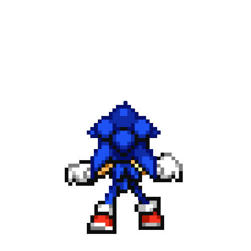

                                                                          
<h1 align="center">Hi 👋, I'm Barshan</h1>
<h3 align="center">Trying And Creating Imaginations | Second Year EAC Student | Kooky</h3>

  

  

- 🔭 I’m currently working on **[Digital Forensics and Incident Response](https://www.crowdstrike.com/cybersecurity-101/digital-forensics-and-incident-response-dfir/)**

- 🌱 I’m currently learning **[Memory Forensics](https://stuxnet999.github.io/volatility/2020/08/18/Basics-of-Memory-Forensics.html)**

- 👯 I’m looking for help in **[Making my Future Brighter](https://www.youtube.com/watch?v=fx2Z5ZD_Rbo)**

- 💬 Ask me about **[my grades :))](https://www.youtube.com/watch?v=dQw4w9WgXcQ)**

- 📫 How to reach me **[Email](blueeeeee04@gmail.com) , Discord - *B1u33#0108* Or [Twitter](https://twitter.com/b1u33_04)**

- ⚡ Quote **[Coming together is a beginning.](https://www.youtube.com/watch?v=Y_PCjw5WKpo)** 

<h3 align="left">Connect with me:</h3>

<h3 align="left">Languages and Tools:</h3>

             

&nbsp;

